# Mobile filter drawer + single-table player view

Review assets for the PR that closes the mobile filter rail on load, gives it a
persistent "Filters (n)" button, and replaces the per-season cards in the
single-player view with one table.

Every shot is headless Chromium against the same build and the same
`data/data.json`. Phone shots are 375 CSS px wide, desktop shots 1280.

A note on light / dark: neither `css/polymarket.css` nor `css/styles.css`
contains a single `prefers-color-scheme` rule, so the tool has no dark theme.
Shots captured under `colorScheme: 'dark'` come back byte-identical to their
light twins — `rail-closed-375-dark.png` and `player-sga-contracted-seasons-1280-dark.png`
are here as evidence of that, not as a second palette.

## Mobile filter rail — 375 px

### Closed on load

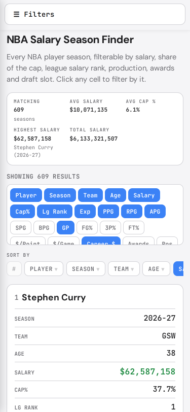

The rail no longer opens over the results on load. The results are the first
thing on screen, with the fixed "Filters" button above them.

### Open

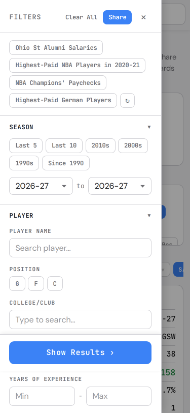

Overlay drawer with a backdrop, a close button in the header and "Show Results"
pinned to the bottom. Escape and a backdrop tap close it too, and filter state
survives every close path.

### Active filter count

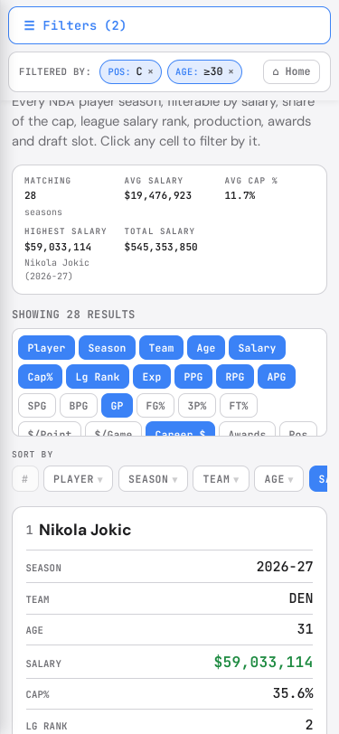

The count is the same tag list the breadcrumb trail renders, so the two cannot
disagree.

### Still there at depth

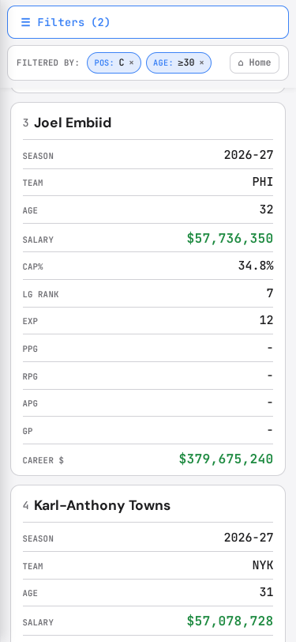

Scrolled well down the results; the button is fixed, not sticky-within-a-parent.

### Dark

Identical to the light shot — see the note above.

### Desktop unchanged — 1280 px

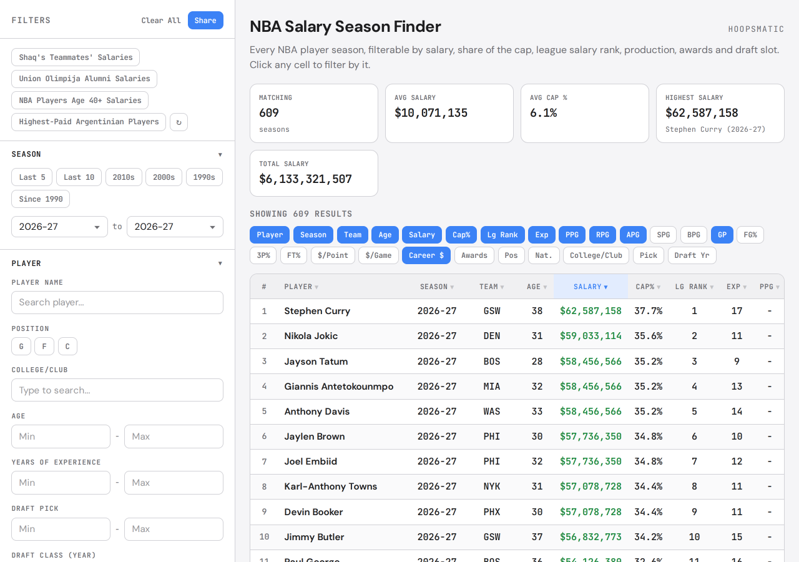

Element geometry for the sidebar, main content, header, summary strip, table
wrapper, table, first row, column toggles and footer was compared against
`main` at 1280 and 1024 px: no differences.

## Player view

### Mid-season trade — DeMar DeRozan

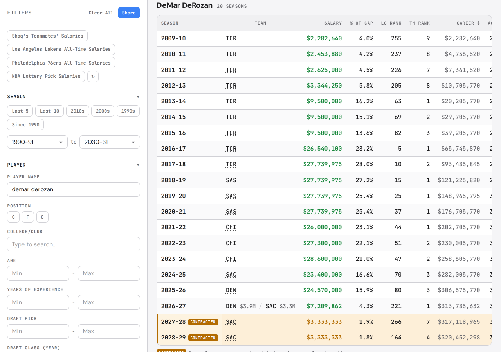

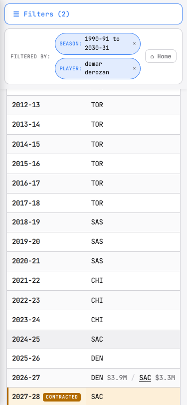

Twenty seasons oldest first. 2026-27 has `team_salaries` for two teams, so the
team cell carries the split.

### Three-way split — Kemba Walker

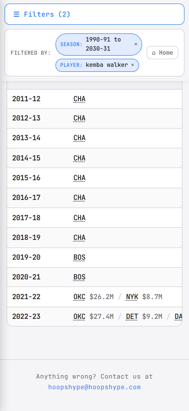

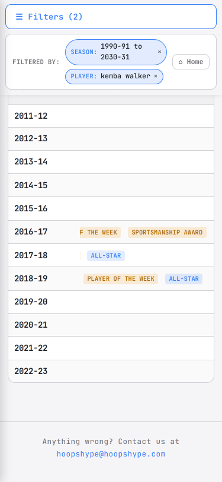

2022-23 splits across OKC, DET and DAL. The second shot is the same table
scrolled fully right: the season column stays frozen and the page body has not
moved.

### Contracted future seasons — Shai Gilgeous-Alexander

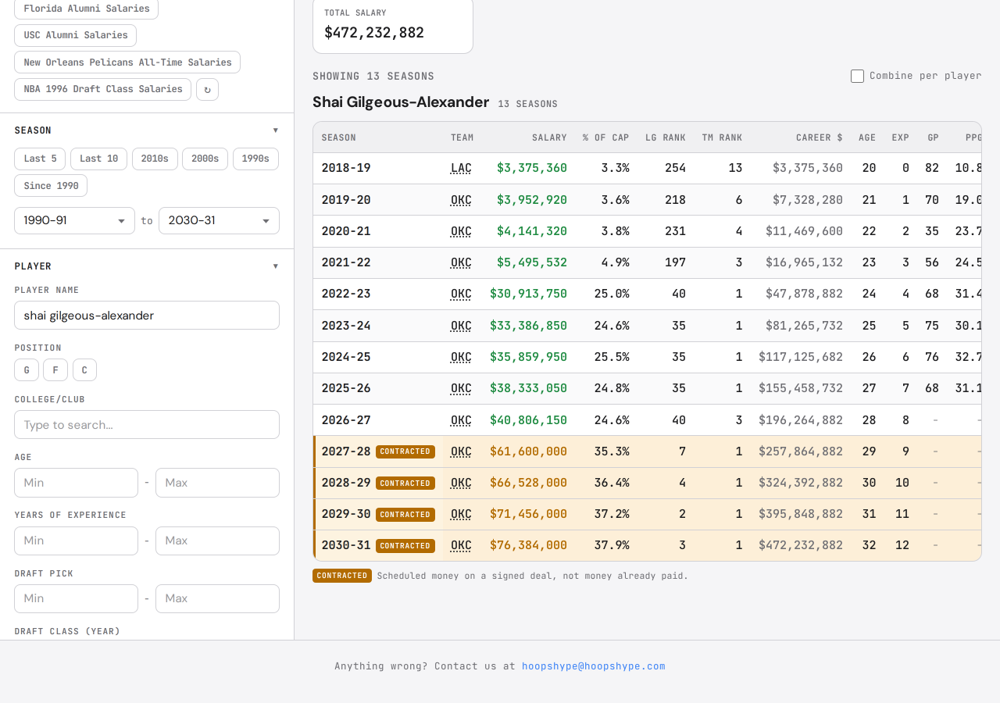

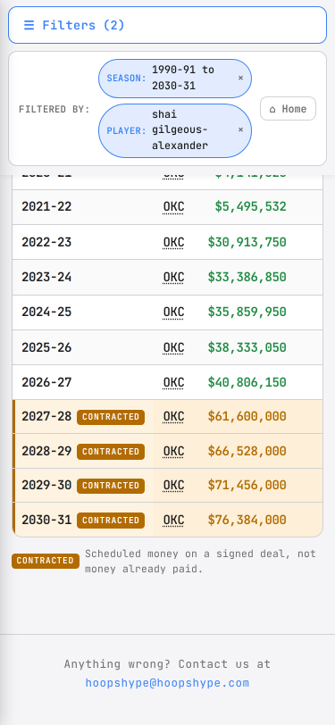

2027-28 through 2030-31 sit past the current season, which is derived from
`computeDefaultSeason()` rather than hardcoded. They get the tinted row, the
left accent rule, the "contracted" pill and the footnote.

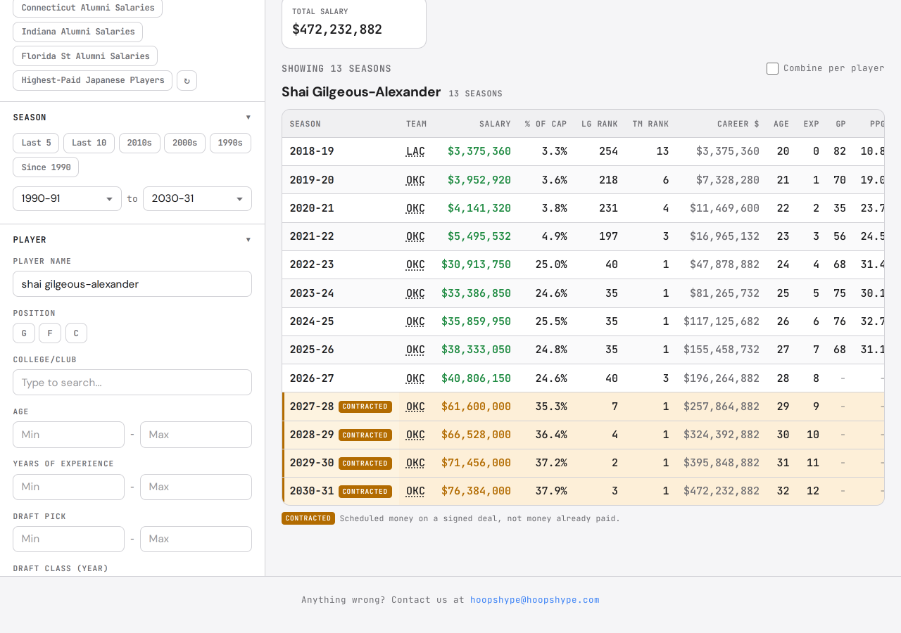

### Single season — Patric Young

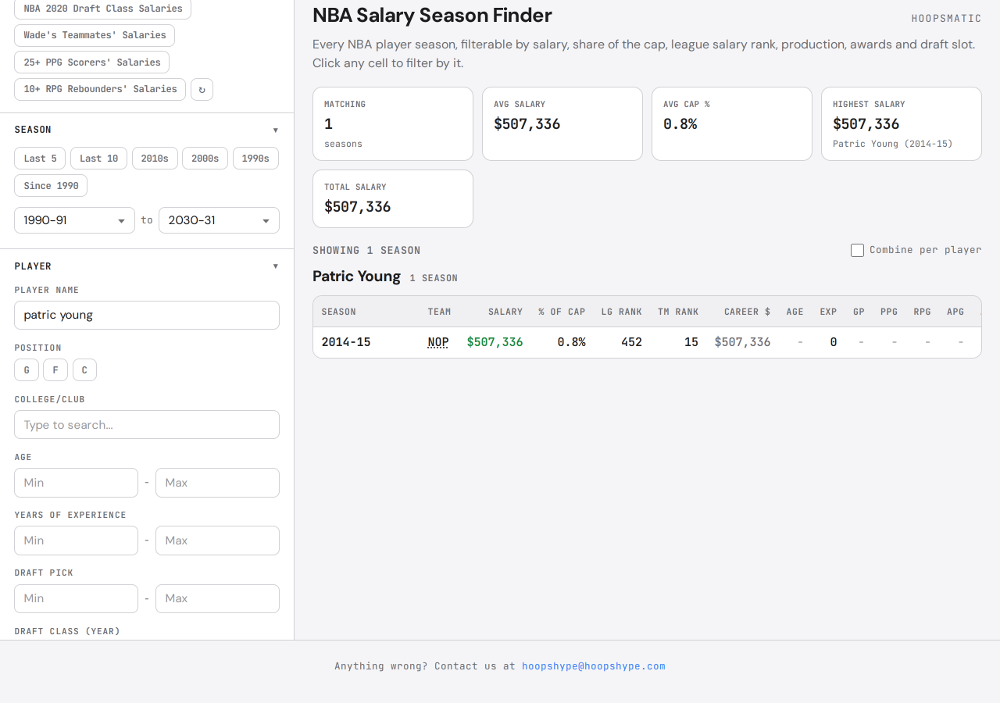

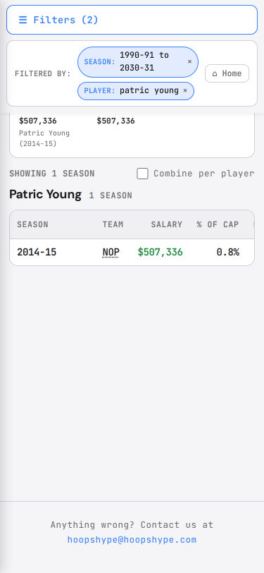

One row, one season, no contracted footnote, and with no awards to carry the
table fits its container without scrolling.
