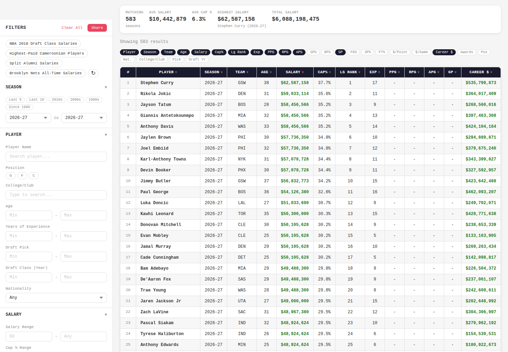
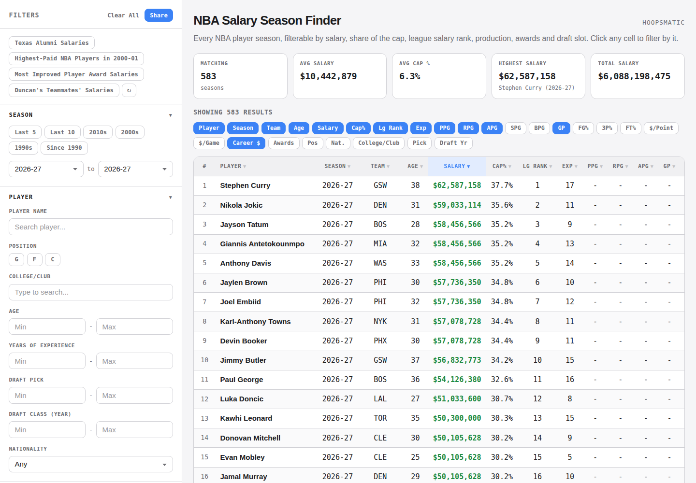
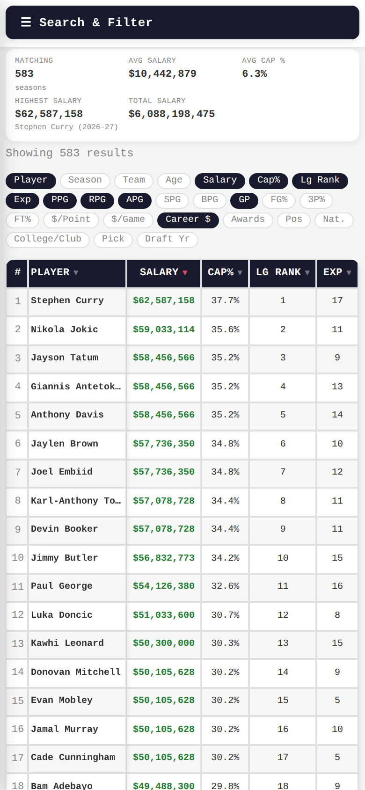
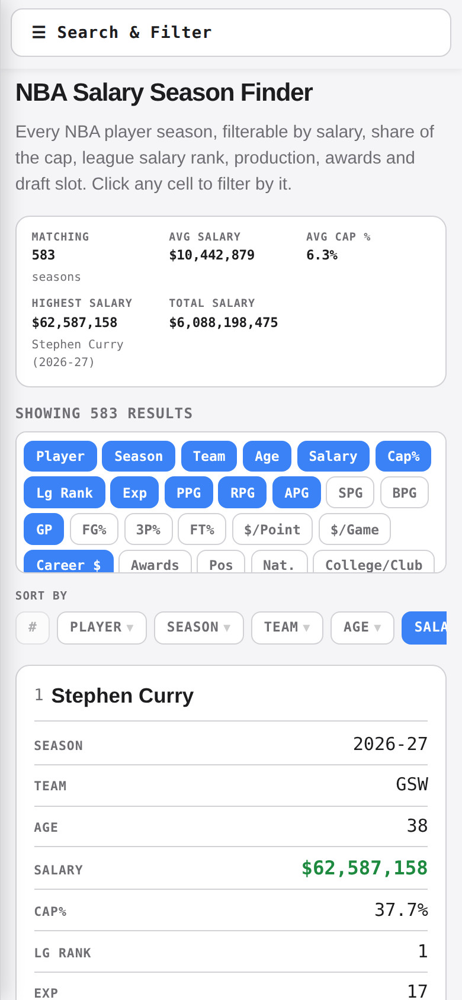
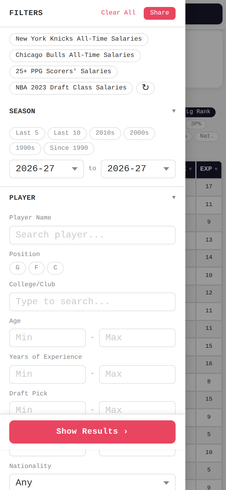
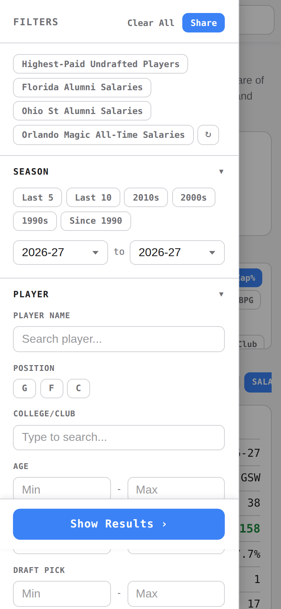
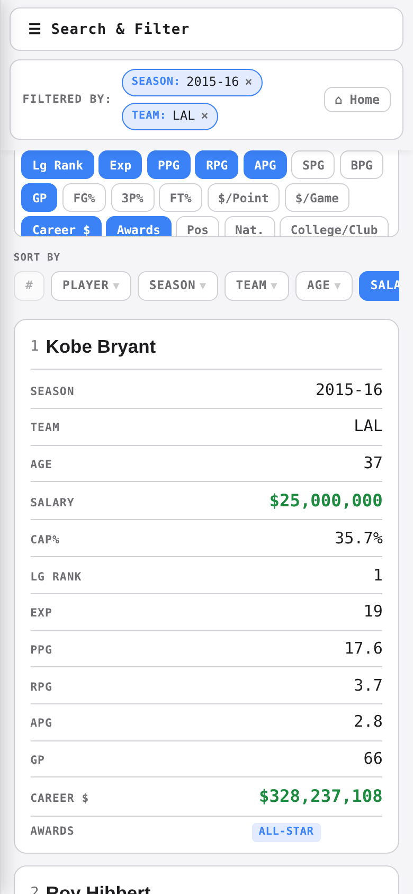

# Design system restyle — before / after

Review assets for the PR that moves the Salary Season Finder onto the shared
HoopsMatic design system (`css/polymarket.css`, a verbatim copy of
`nba-polymarket/docs/styles.css`).

Both columns are the same build of the app against the same `data/data.json`,
on the default season, with no filters applied. "Before" is `main`.

## Desktop — 1440 × 1000

### Before

### After

The palette moves to the design system's surface/border/accent tokens, DM Sans
carries the prose and JetBrains Mono the numbers and labels, the summary strip
becomes stat cards, the filter and column rails become chips, and the results
table picks up the `table.lb` treatment: header row on `--surface-hover` with
uppercase secondary labels, and the sorted column tinted with `--accent-dim`.

Zebra striping is kept as a local addition on top of that treatment. The design
system's own tables carry five or six columns and get by on row borders alone;
this one carries up to twenty-seven, and the stripe is what keeps the eye on a
row across the full scroll width. The frozen rank and player columns paint the
stripe too, so a striped row does not show two white cells at its left edge.

## Mobile — 390 × 844

### Before

A sideways-scrolling table with the rank and player columns frozen. Everything
past Exp lives off-screen to the right, and Season, Team and Age were hidden
outright below 768px to push Salary into the third slot.

### After

Each row becomes a card of label/value lines, fed by the `data-label` attribute
now rendered on each cell. The header row becomes a horizontally scrolling rail
of sort chips under a "Sort by" label, so sorting survives the loss of the
column headings. The 27 column-toggle chips are capped in a scroll box, the way
reporter-rankings caps its team and player picker.

Season, Team and Age are back on a phone: the rule that hid them existed only to
win space in the horizontal scroll, and card mode has no horizontal scroll. A
phone now gets the same default columns as a desktop, which also means tapping a
Team or Season cell filters by it there, as it always has on desktop.

## Mobile filter drawer

### Before

### After

## A card carrying the wide columns

Awards column enabled, season pinned to 2015-16, and a team cell-click filter
active so the breadcrumb bar is in shot.

---

These files sit under `.github/` so GitHub Pages does not publish them, and they
are their own commit on the PR branch. Safe to drop before merge.
